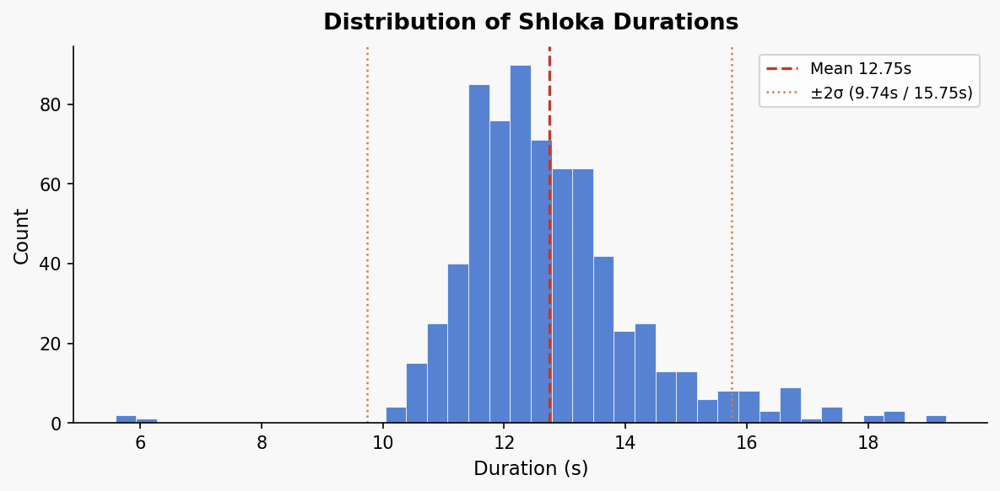
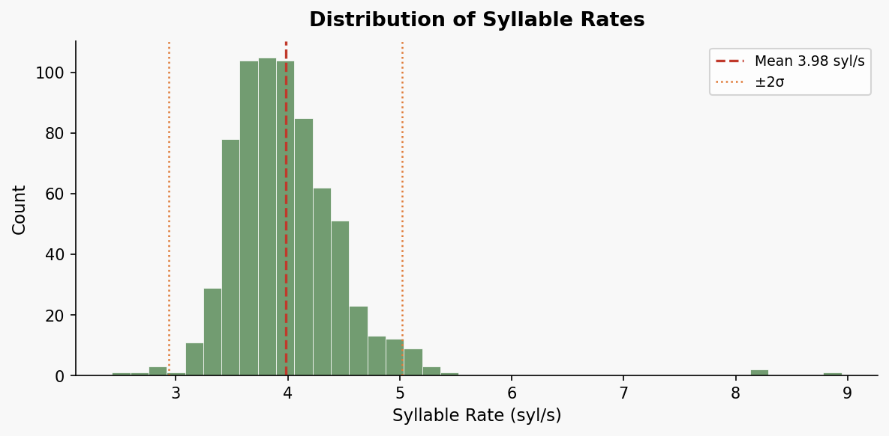
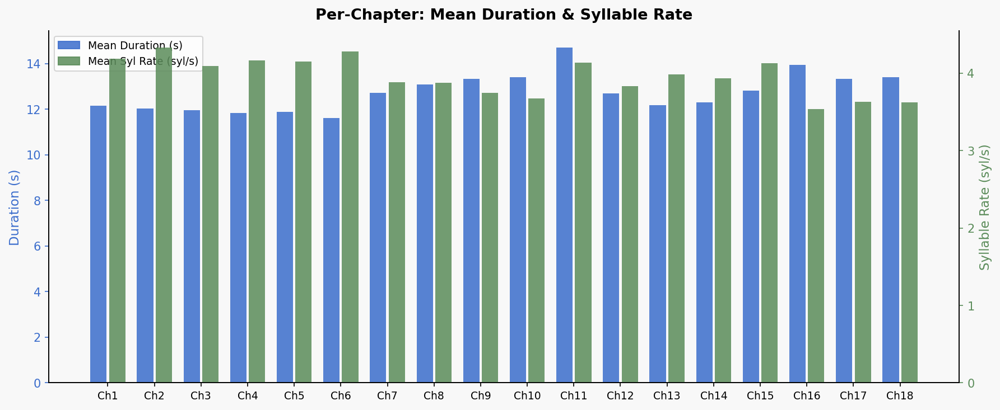
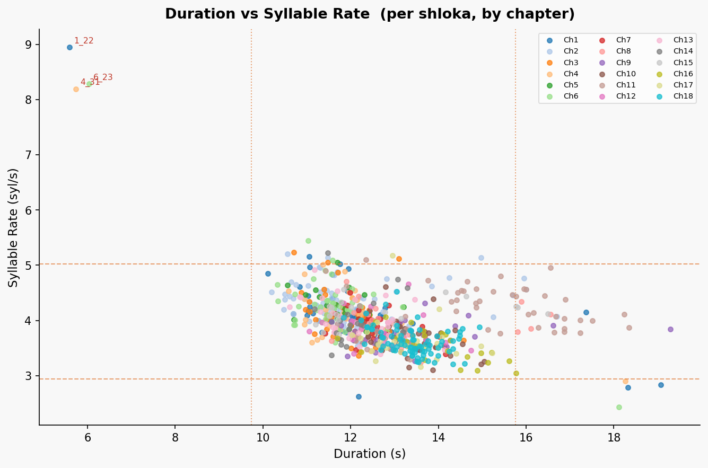
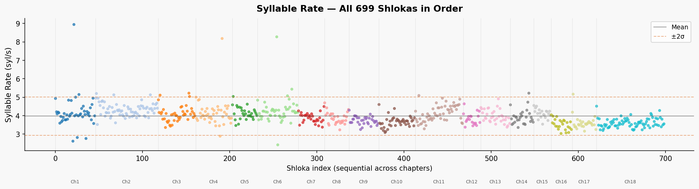
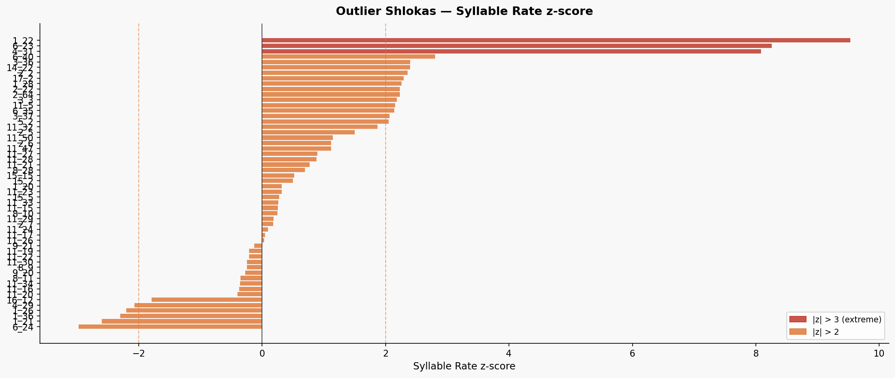

# Bhagavad Gita — Audio Duration & Syllable Rate Analysis

**Dataset:** `final_shlokas_1/wav_48k` — 699 shlokas, 48 kHz WAV  
**Syllable counts:** `transcript_with_syllables.tsv` (Devanagari syllable count per shloka)

---

## Global Statistics

| Metric | Value |
|---|---|
| Total shlokas | 699 |
| Mean duration | 12.75 s |
| Std duration | 1.50 s |
| Min duration | 5.59 s |
| Max duration | 19.29 s |
| Mean syllable rate | 3.98 syl/s |
| Std syllable rate | 0.52 syl/s |
| Min syllable rate | 2.43 syl/s |
| Max syllable rate | 8.95 syl/s |
| Outliers (\|z\| > 2) | 54 shlokas |

---

## Duration Distribution



Most shlokas fall between 11–15 s. The dashed line marks the mean (12.75 s); dotted lines mark ±2σ. Files outside these bounds are flagged as outliers.

---

## Syllable Rate Distribution



The distribution is roughly normal around 3.98 syl/s. The long right tail (>7 syl/s) corresponds to the three likely-corrupted files.

---

## Per-Chapter Overview



| Chapter | Shlokas | Mean Duration (s) | Mean Syl Rate (syl/s) |
|---|---|---|---|
| 1 | 46 | 12.16 | 4.19 |
| 2 | 72 | 12.03 | 4.33 |
| 3 | 43 | 11.95 | 4.09 |
| 4 | 42 | 11.84 | 4.17 |
| 5 | 29 | 11.89 | 4.15 |
| 6 | 47 | 11.62 | 4.28 |
| 7 | 30 | 12.71 | 3.89 |
| 8 | 28 | 13.08 | 3.88 |
| 9 | 34 | 13.33 | 3.75 |
| 10 | 42 | 13.41 | 3.67 |
| **11** | **55** | **14.70** | 4.14 |
| 12 | 20 | 12.69 | 3.84 |
| 13 | 34 | 12.17 | 3.99 |
| 14 | 27 | 12.31 | 3.94 |
| 15 | 20 | 12.82 | 4.13 |
| 16 | 24 | 13.94 | 3.54 |
| 17 | 28 | 13.33 | 3.63 |
| 18 | 78 | 13.41 | 3.62 |

> Ch 11 (Vishvarupa Darshana) has the longest mean duration (14.70 s) because several shlokas contain extra verses. Chapters 1–6 run faster (4.1–4.3 syl/s) than the later chapters.

---

## Duration vs Syllable Rate (per shloka)



Each dot is one shloka, coloured by chapter. Dashed lines mark the ±2σ boundaries. The three extreme points in the top-left corner (very short duration + very high rate) are the corrupted files.

---

## Syllable Rate Across All Shlokas



Shlokas plotted in order across all 18 chapters. The visible drift toward a lower rate in chapters 16–18 is consistent with the per-chapter table above.

---

## Outlier Shlokas — z-score Summary



54 shlokas flagged (|dur\_z| > 2 or |rate\_z| > 2). z-scores relative to the global mean.

### Extreme outliers — likely corrupted / mis-trimmed audio

Durations under 6 s, syllable rates above 8 syl/s (>8σ). Should be re-exported.

| Shloka | Duration (s) | Syllables | Syl Rate | dur_z | rate_z |
|---|---|---|---|---|---|
| **1_22** | 5.589 | 50 | 8.946 | −4.76 | **+9.53** |
| **6_23** | 6.037 | 50 | 8.282 | −4.46 | **+8.26** |
| **4_31** | 5.739 | 47 | 8.190 | −4.66 | **+8.08** |

### Too slow — possibly missing a verse or has extra silence

| Shloka | Duration (s) | Syllables | Syl Rate | dur_z | rate_z |
|---|---|---|---|---|---|
| 6_24 | 18.112 | 44 | 2.429 | +3.57 | −2.98 |
| 1_21 | 12.181 | 32 | 2.627 | −0.38 | −2.60 |
| 1_36 | 18.325 | 51 | 2.783 | +3.71 | −2.30 |
| 1_26 | 19.072 | 54 | 2.831 | +4.21 | −2.20 |
| 4_29 | 18.261 | 53 | 2.902 | +3.67 | −2.07 |

### Too fast (rate_z > 2)

| Shloka | Duration (s) | Syllables | Syl Rate | dur_z | rate_z |
|---|---|---|---|---|---|
| 6_40 | 11.029 | 60 | 5.440 | −1.14 | +2.80 |
| 3_36 | 10.709 | 56 | 5.229 | −1.35 | +2.40 |
| 14_22 | 11.477 | 60 | 5.228 | −0.84 | +2.40 |
| 2_2  | 10.560 | 55 | 5.208 | −1.45 | +2.36 |
| 17_2 | 12.949 | 67 | 5.174 | +0.13 | +2.29 |
| 1_28 | 11.051 | 57 | 5.158 | −1.13 | +2.26 |
| 2_64 | 11.477 | 59 | 5.141 | −0.84 | +2.23 |
| 2_22 | 14.976 | 77 | 5.142 | +1.48 | +2.23 |
| 3_3  | 13.099 | 67 | 5.115 | +0.23 | +2.18 |
| 11_5 | 12.352 | 63 | 5.100 | −0.26 | +2.15 |
| 6_35 | 11.584 | 59 | 5.093 | −0.77 | +2.14 |
| 3_37 | 11.477 | 58 | 5.053 | −0.84 | +2.06 |
| 5_2  | 11.691 | 59 | 5.047 | −0.70 | +2.05 |

### Long duration but normal rate (likely genuinely longer shlokas)

| Shloka | Duration (s) | Syllables | Syl Rate | dur_z | rate_z |
|---|---|---|---|---|---|
| 9_20  | 19.285 | 74 | 3.837 | +4.35 | −0.27 |
| 1_26  | 19.072 | 54 | 2.831 | +4.21 | −2.20 |
| 11_22 | 18.347 | 71 | 3.870 | +3.72 | −0.21 |
| 1_36  | 18.325 | 51 | 2.783 | +3.71 | −2.30 |
| 11_15 | 18.240 | 75 | 4.112 | +3.65 | +0.26 |
| 6_24  | 18.112 | 44 | 2.429 | +3.57 | −2.98 |
| 1_20  | 17.365 | 72 | 4.146 | +3.07 | +0.32 |
| 11_26 | 17.515 | 70 | 3.997 | +3.17 | +0.03 |
| 11_17 | 17.237 | 69 | 4.003 | +2.99 | +0.05 |
| 11_20 | 17.237 | 65 | 3.771 | +2.99 | −0.40 |

---

## How the Analysis Was Done

```python
# Duration via Python stdlib wave module
import wave
with wave.open(path, 'rb') as wf:
    duration = wf.getnframes() / wf.getframerate()

# Syllable rate
syl_rate = syllable_count / duration

# Outlier threshold: |z-score| > 2
z = (value - mean) / std
```

Syllable counts sourced from `bg/transcript_with_syllables.tsv` (column `dev_syl`).  
Plots generated with `matplotlib 3.5.1` / `numpy 1.26.4`.
